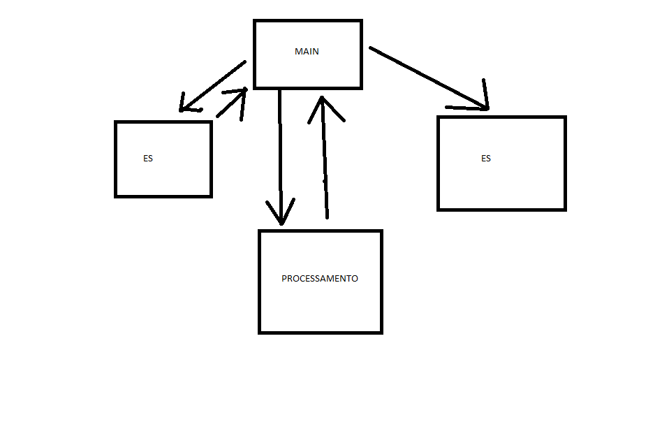

# Projeto de Arquitetura

A aplicação é formada pelos módulos Main, Entrada e Saída de Dados e Processamento.

Main chama a entrada de dados, que retorna os dados ao Main. Depois é feito o processamento e entregue ao Main, que finalmente apresenta os resultados na saída de dados.

